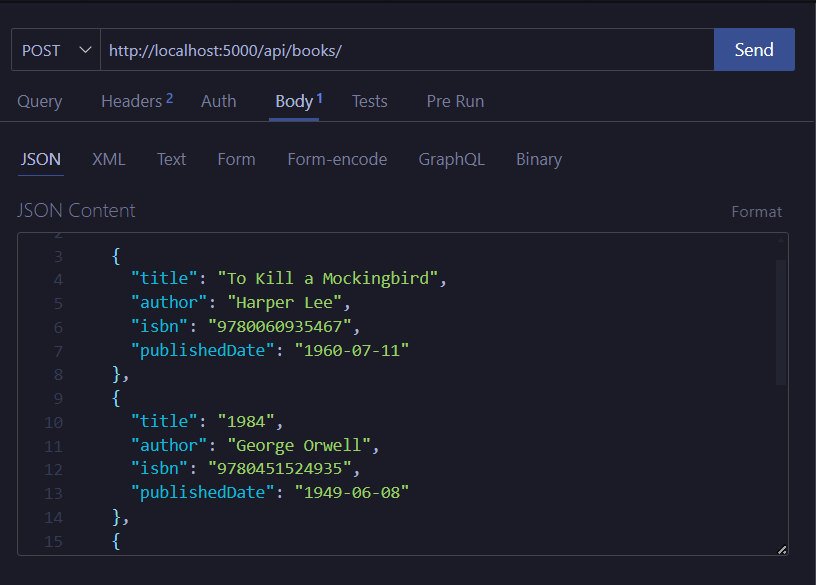
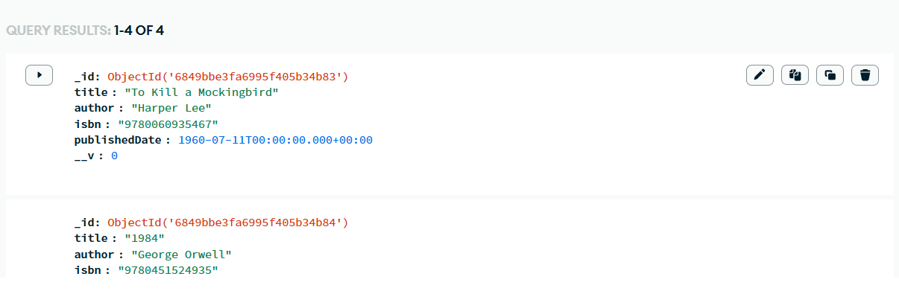

# 📚 Library API

A simple RESTful API built using **Node.js**, **Express**, and **MongoDB Atlas** to manage a collection of books. This API allows you to create, read, update, and delete (CRUD) book records via HTTP requests.

---

## ⚙️ Tech Stack

- Node.js
- Express.js
- MongoDB Atlas (cloud-hosted database)
- Mongoose (MongoDB ORM)
- Thunder Client / Postman (for API testing)
- Dotenv (for environment variable management)

---

## 📁 Project Structure

```
library-api/
│
├── app.js                  # Entry point
├── .env                    # Environment variables (not pushed to GitHub)
├── .gitignore              # Hides node_modules and .env
├── package.json
├── /models
│   └── book.js             # Book schema
├── /routes
│   └── bookRoutes.js       # All book-related routes
└── README.md
```

---

## 🚀 Features

- Connects to MongoDB Atlas using environment variables
- RESTful endpoints for books
  - Create a book
  - Get all books
  - Get a single book by ID
  - Update a book by ID
  - Delete a book by ID
- Supports JSON requests
- Modular folder structure for scalability

---

## ▶️ Getting Started (Run Locally)

1. **Clone the repo**

```bash
git clone https://github.com/yourusername/library-api.git
cd library-api
```

2. **Install dependencies**

```bash
npm install
```

3. **Create `.env` file**

```env
MONGO_URI=your_mongodb_atlas_uri
```

4. **Start the server**

```bash
npm start
```

By default, server runs on:  
`http://localhost:5000`

---

## 🔌 API Endpoints

Base URL: `/api/books`

| Method | Endpoint           | Description          |
|--------|--------------------|----------------------|
| GET    | `/api/books`       | Get all books        |
| GET    | `/api/books/:id`   | Get a book by ID     |
| POST   | `/api/books`       | Add a new book       |
| PUT    | `/api/books/:id`   | Update a book by ID  |
| DELETE | `/api/books/:id`   | Delete a book by ID  |

### 📦 Sample POST Body
```json
{
  "title": "Atomic Habits",
  "author": "James Clear",
  "year": 2018,
  "genre": "Self-help"
}
```

---

## 📸 Screenshots

Add your own screenshots by uploading them in your GitHub repo.

### ✍️ How to Add Screenshots:
1. Take screenshots of:
   - Thunder Client POST request
   - MongoDB Atlas data
   - API folder structure in VS Code
2. Save them inside a `screenshots/` folder in your project.
3. Reference them like:

```markdown


```

---

## 🌐 Deployment (Render)

This project is deployed on **Render**.

👉 **Live URL:** [https://your-api-url.onrender.com](https://your-api-url.onrender.com)


---


## 🧠 Author

**Sparsh Birla**  
[LinkedIn](https://linkedin.com/in/sparshbirla/) | [GitHub](https://github.com/sparsh13b)

---


